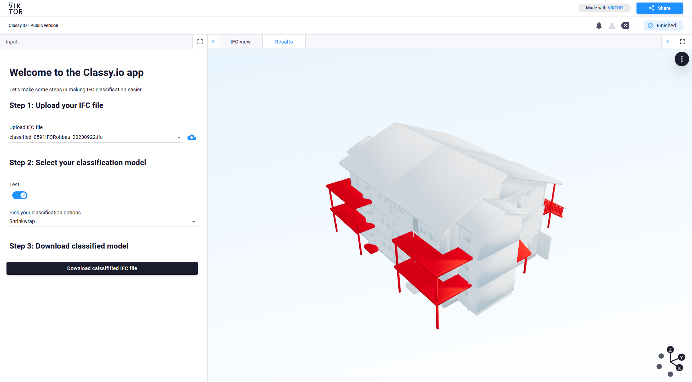

# Classy.io

Classy.io - A project that will revolutionize the AEC industry...



## How to run the application
The application is built using the [VIKTOR](https://www.viktor.ai/) platform. If you do not have access to the VIKTOR 
platform yet, you can sign up for the [free version](https://www.viktor.ai/start-building-apps).

The following steps assume that you have gone through the onboarding that are presented after you have signed up. If not, 
refer to the [Getting Started - Install VIKTOR](https://docs.viktor.ai/docs/getting-started/installation/) in the [VIKTOR 
documentation](https://docs.viktor.ai/)

### Clear database
Before starting, just to be sure, we'll clear the database before installing the app, as it could contain information 
of the demo app or any other apps you installed before. In the terminal, run:

```commandline
viktor-cli clear
```

### Install app
Now we'll install your app and all its dependencies by running this command in the terminal. Just be patient, this 
could take up to 5 minutes... Maybe it's time for a ☕?

```commandline
viktor-cli install
```

After the installation you should see:

```commandline
The application has successfully been installed. Use the command 'viktor-cli start' to start your app.
PS C:\Users\<username>\viktor-apps\3d-building-tutorial>
```

### Start app
Well, let's follow the instructions on the terminal and start the app:

```commandline
viktor-cli start
```

If all went well, your empty app is installed and running one your development workspace. Do not close the terminal as 
this will break the connection with your app.

You can see your app which you can see by visiting the URL shown in the terminal (for example https://cloud.viktor.ai)

Your terminal should show something like this:

```commandline
 INFO     : Connecting to platform...
 INFO     : Connection is established: https://cloud.viktor.ai  <---- here you can see your app
 INFO     : The connection can be closed using Ctrl+C
 INFO     : App is ready
```

#### Re-starting your app
- You only need create an app template and install it once for each new app you want to make.
- The app will update automatically once you start adding code in app.py, as long as you don't close the terminal or your IDE.
- Did you close your IDE? Use viktor-cli start to start the app again. No need to install, clear, etc.
